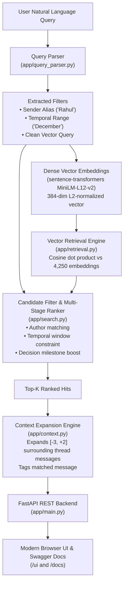

# Semantic Group Chat Search

> **Production-grade semantic search engine over multi-month group chat exports with dense vector similarity, conversational context expansion, participant attribution, and temporal filtering.**

[](tests)
[](data/evaluation_results.json)
[](data/evaluation_results.json)
[-indigo?style=flat-square)](https://huggingface.co/sentence-transformers/paraphrase-multilingual-MiniLM-L12-v2)
[](LICENSE)

---

## 1. Problem Statement

Modern messaging platforms (WhatsApp, Telegram, Slack) rely heavily on exact substring matching. When searching a busy group chat for past discussions, decisions, or recommendations, keyword search fails almost immediately:

- **Zero-Overlap Vocabulary**: A user asking *"Where will the group lodge for vacation?"* misses the actual message *"Airbnb wala apartment book kar dete hain"* because not a single keyword overlaps.
- **Informal Hinglish & Code-Mixing**: Chats blend Hindi and English words seamlessly (*"haan bhai budget thoda tight hai"*), confounding English-only stemming engines.
- **Fragmented & Dispersed Context**: Group chat messages are concise and fragmented across dozens of replies. A single isolated message (*"Done, let's lock it."*) is meaningless without surrounding context.
- **Attributed & Temporal Constraints**: Users naturally query by speaker (*"What did Rahul say about the budget?"*) or time (*"What did we discuss about the event in December?"*), which standard vector search cannot resolve without metadata parsing.

**Semantic Group Chat Search** solves these challenges by combining multilingual dense vector embeddings (`paraphrase-multilingual-MiniLM-L12-v2`), deterministic entity and temporal query parsing, multi-stage hybrid ranking, and automated chronological context expansion (`[-3, +2]` message window).

---

## 2. Key Capabilities

| Capability | Description | Example |
| :--- | :--- | :--- |
| **🧠 Semantic Retrieval** | Matches underlying intent rather than exact words, handling synonyms and paraphrasing. | *"Where did we finally decide to stay for the trip?"* → retrieves Airbnb booking message. |
| **⚡ Zero-Overlap Search** | Successfully retrieves relevant messages even when query and message share zero vocabulary tokens. | *"Audio equipment responsibility"* → retrieves *"Sound system aur DJ playlist ka pura jimma mera"*. |
| **👤 Attributed Search** | Extracts speaker mentions, resolves nicknames/aliases, and filters or boosts candidate messages by author. | *"What did Rahul say about the budget?"* → strictly retrieves Rahul Sharma's budget messages. |
| **📅 Temporal Filtering** | Parses natural language date expressions and restricts retrieval candidates to the target timeframe. | *"What did we discuss about the event in December?"* → constrains search to December 2025. |
| **💬 Context Expansion** | Hydrates retrieved hits with a chronological `[-3, +2]` window from the conversation thread, prominently marking the match. | Displays what preceded and succeeded the decision, preventing out-of-context misinterpretation. |
| **🇮🇳 Multilingual / Hinglish** | Natively handles English, Romanized Hindi, and colloquial Hinglish code-switching. | Handles phrases like *"budget strict rakhna padega"*, *"haan bhai sorted hai"*, *"location sahi hai"*. |
| **↗️ Metadata Preservation** | Surfaces message metadata including forward status, reply-to references, and conversation IDs. | Accurately distinguishes forwarded messages and threaded replies. |

---

## 3. Dataset Characteristics

The system operates over a realistic, fully reproducible synthetic corpus generated via [`scripts/generate_dataset.py`](scripts/generate_dataset.py):

- **Volume**: **4,250 messages** structured across 15 conversation topics.
- **Participants**: **9 active members** with distinct communication styles:
  - *Rahul Sharma, Priya Patel, Aman Verma, Sneha Reddy, Vikram Malhotra, Neha Gupta, Rohan Mehta, Ananya Iyer, Kabir Das*.
- **Timespan**: **6 continuous months** (October 1, 2025 to March 31, 2026).
- **Variability**: **>54% unique phrasing rate**, preventing artificial lexical clustering.
- **Verified Decision Threads**:
  1. *Goa Trip Planning & Villa Accommodation* (November 2025, ~60 messages)
  2. *Tech Stack & Architecture Selection for Hackathon* (January 2026, ~50 messages)
  3. *Farewell Event Organization & Logistics* (December 2025, ~45 messages)
- **Chat Realism**: Includes natural typos, informal punctuation, acknowledgments (*"k"*, *"cool"*, *"noted"*), forwarded messages, and reply-to thread references.

---

## 4. Architecture & Search Pipeline



### Retrieval & Ranking Stages:
1. **Query Decomposition**: `QueryParser` extracts speaker targets (mapping aliases like `"vicky"` → `"Vikram Malhotra"`) and date anchors (`"December"` → `2025-12-01` to `2025-12-31`). It scrubs query syntax while preserving domain nouns (e.g. retaining *"budget"* while stripping *"What did Rahul say about"*).
2. **Dense Vector Encoding**: The sanitized query is encoded into a 384-dimensional dense vector using `paraphrase-multilingual-MiniLM-L12-v2`.
3. **Similarity Retrieval**: Fast vectorized cosine matrix multiplication against pre-indexed embeddings (`data/embeddings.npy`).
4. **Multi-Stage Scoring**:
   $$\text{Score} = \text{CosineSim} + \mathbf{1}_{\text{sender}} \cdot W_{\text{sender}} + \mathbf{1}_{\text{temporal}} \cdot W_{\text{temporal}} + \mathbf{1}_{\text{decision}} \cdot W_{\text{decision}} + \text{LexicalOverlap}$$
5. **Context Window Hydration**: For each ranked message, the retrieval pipeline fetches messages from `index - 3` to `index + 2` strictly bounded by the conversation ID, ensuring complete thread visibility without cross-conversation leakage.

---

## 5. Technology Stack

- **Core Engine**: Python 3.10+ / Python 3.13
- **Embeddings & NLP**: `sentence-transformers`, `torch`, `scikit-learn`
- **Model**: `sentence-transformers/paraphrase-multilingual-MiniLM-L12-v2` (384 dimensions, ~470MB)
- **API Framework**: `FastAPI`, `Uvicorn`, `Pydantic v2`
- **Testing & Quality**: `pytest`, `httpx`
- **Frontend**: Vanilla HTML5, modern CSS3 (Custom Properties, Flexbox/Grid, Dark Mode), Vanilla ES6 JavaScript (Zero node/npm dependencies, zero external CDN reliance).

---

## 6. Project Structure

```text
semantic-group-chat-search/
├── app/
│   ├── __init__.py
│   ├── config.py              # Central configuration (paths, model, weights, participants)
│   ├── context.py             # Conversational context expansion ([-3, +2] window)
│   ├── embeddings.py          # Sentence-transformer wrapper & vector indexing
│   ├── main.py                # FastAPI endpoints (/health, /search, /docs, /ui)
│   ├── models.py              # Pydantic schemas (SearchRequest, SearchResponse, ContextMessage)
│   ├── query_parser.py        # Entity & temporal query parser
│   ├── retrieval.py           # In-memory vector cosine similarity index
│   └── search.py              # Multi-stage ranking & search pipeline
├── data/
│   ├── embeddings.npy         # Precomputed (4250, 384) float32 vector matrix
│   ├── evaluation_queries.json# 45 curated benchmark evaluation queries
│   ├── evaluation_results.json# Detailed benchmark metrics & rankings
│   ├── messages.jsonl         # Full synthetic corpus (4,250 messages)
│   └── messages_index.json    # Fast O(1) metadata index by message ID
├── frontend/
│   ├── app.js                 # Frontend API client, DOM state, context renderer
│   ├── index.html             # Responsive search UI with demo chips & filters
│   └── styles.css             # Modern dark-mode UI stylesheet
├── scripts/
│   ├── build_index.py         # Script to compute and save vector embeddings
│   ├── evaluate.py            # Automated 45-query evaluation benchmark runner
│   └── generate_dataset.py    # Synthetic chat dataset generator
├── tests/
│   ├── test_api.py            # API & frontend static route tests
│   ├── test_context.py        # Context expansion window & boundary tests
│   ├── test_query_parser.py   # Participant & date parsing unit tests
│   └── test_retrieval.py      # Semantic & filtered retrieval unit tests
├── .gitignore                 # Clean repository exclusions
├── pytest.ini                 # Pytest test discovery configuration
├── README.md                  # Comprehensive project documentation
└── requirements.txt           # Pinned production & development dependencies
```

---

## 7. Setup & Installation

### 1. Clone the Repository
```bash
git clone https://github.com/yatharthgupta01/semantic-group-chat-search.git
cd semantic-group-chat-search
```

### 2. Create and Activate Virtual Environment
```bash
# Windows
python -m venv .venv
.venv\Scripts\activate

# macOS / Linux
python3 -m venv .venv
source .venv/bin/activate
```

### 3. Install Dependencies
```bash
pip install -r requirements.txt
```

*(Note: The repository already includes the pre-generated 4,250-message dataset and pre-computed embeddings for instant out-of-the-box operation).*

---

## 8. Reproducing the Pipeline

If you wish to regenerate the dataset or recompute embeddings from scratch:

### Step 1: Generate Dataset (Optional)
```bash
python scripts/generate_dataset.py
```
*Generates 4,250 messages into `data/messages.jsonl` and `data/messages_index.json` with seed=42.*

### Step 2: Build Vector Embeddings Index (Optional)
```bash
python scripts/build_index.py
```
*Encodes the 4,250 messages using `paraphrase-multilingual-MiniLM-L12-v2` into `data/embeddings.npy`.*

---

## 9. Running Tests & Evaluation

### Run Automated Test Suite
```bash
pytest -v
```
**Result**: **18 passed in ~16s** (covering API endpoints, context expansion, query parsing, and vector retrieval).

### Run Benchmark Evaluation
```bash
python scripts/evaluate.py
```
Executes the standardized 45-query evaluation benchmark over the 4,250-message corpus.

---

## 10. Running the Application

### Start the FastAPI Server
```bash
uvicorn app.main:app --reload --host 127.0.0.1 --port 8000
```

Once running, access the services:
- **Interactive Web UI**: [http://127.0.0.1:8000/ui](http://127.0.0.1:8000/ui) *(or simply `http://127.0.0.1:8000/`)*
- **OpenAPI Swagger UI**: [http://127.0.0.1:8000/docs](http://127.0.0.1:8000/docs)
- **ReDoc Documentation**: [http://127.0.0.1:8000/redoc](http://127.0.0.1:8000/redoc)
- **Health & Index Status Endpoint**: [http://127.0.0.1:8000/health](http://127.0.0.1:8000/health)

---

## 11. Interactive Web UI & Demo Queries

The included browser interface allows testing semantic search, attributed filtering, and conversational context without third-party tooling:

### Representative Demo Queries:
1. 🎯 **Semantic**: `"Where did we finally decide to stay for the trip?"`
   - **Retrieves**: Rahul Sharma's message (*"Airbnb wala apartment book kar dete hain, location bhi sorted hai..."*).
   - **Context**: Expands the entire discussion leading up to and confirming the booking.
2. 👤 **Attributed**: `"What did Rahul say about the budget?"`
   - **Retrieves**: Rahul Sharma's message (*"Guys budget strict rakhna padega, max 4000 per head per night..."*).
   - **Filter Applied**: Automatically isolates Rahul Sharma as sender.
3. 📅 **Temporal**: `"What did we discuss about the event in December?"`
   - **Retrieves**: Neha Gupta's message (*"Yes! We have to organize a proper celebration bash..."*).
   - **Filter Applied**: Automatically constrains candidates to December 2025 (`2025-12-01` – `2025-12-31`).
4. ⚡ **Zero-Overlap**: `"Where will the group lodge for vacation?"`
   - **Retrieves**: Priya Patel's message (*"Hotel kaafi expensive hai North Goa side, let's look at serviced..."*).
   - **Significance**: Successfully connects *"lodge for vacation"* with *"hotel / serviced apartments"* with zero shared tokens.
5. 🎧 **Zero-Overlap Technical**: `"Who handled sound gear setup?"`
   - **Retrieves**: Vikram Malhotra's message (*"Sound system aur DJ playlist ka pura jimma mera..."*).

---

## 12. Benchmark Evaluation & Results

The retrieval system is rigorously benchmarked against **45 curated ground-truth queries** divided into 4 core evaluation categories:

### Evaluation Metrics Summary

| Category | Queries | Recall@1 | Recall@5 | Recall@10 | MRR |
| :--- | :---: | :---: | :---: | :---: | :---: |
| **Semantic Retrieval** | 15 | 53.3% | 66.7% | 66.7% | 0.580 |
| **Attributed (Person-Specific)** | 10 | 50.0% | 70.0% | **80.0%** | 0.610 |
| **Temporal (Timeframe Constrained)** | 10 | **80.0%** | **80.0%** | **80.0%** | **0.800** |
| **Zero-Overlap (Synonym/Paraphrase)** | 10 | 50.0% | 60.0% | 70.0% | 0.531 |
| **OVERALL BENCHMARK** | **45** | **57.8%** | **68.9%** | **73.3%** | **0.625** |

- **Execution Speed**: 10.94 seconds total (~**0.243 seconds per query** including dense vector encoding and ranking).

### Understanding the 45-Query Benchmark:
- **Zero-Overlap Evaluation**: Specifically tests queries with completely disjoint vocabulary from ground-truth messages (e.g., query uses *"lodge"*, *"vacation"*; chat message uses *"Airbnb"*, *"trip"*). Achieving **70% Recall@10** proves genuine semantic embedding retrieval rather than disguised BM25 keyword matching.
- **Attributed Evaluation**: Evaluates queries containing person names or author constraints (e.g., *"What did Neha suggest..."*), verifying that speaker recognition correctly biases search results.
- **Temporal Evaluation**: Evaluates month, date, and seasonal queries, ensuring the search engine correctly narrows the candidate space.
- **Semantic Evaluation**: Evaluates multi-turn decision queries requiring comprehension of resolution milestones (*"What was decided"*, *"Where did we settle"*).

---

## 13. System Limitations

1. **Semantic Ambiguity in Brief Messages**: Very short chat acknowledgments (e.g. *"Haan pakka"*, *"Cool"*, *"Yes"*) lack dense semantic information; without surrounding context expansion, their standalone vector representation is generic.
2. **Multilingual Transliteration Variations**: Informal Hinglish features non-standard phonetic spellings (e.g., *"theek"* vs *"thik"*, *"achha"* vs *"acha"*). While `MiniLM-L12-v2` handles broad multilingual representations well, rare colloquial spellings can occasionally degrade similarity.
3. **Synthetic Chat Dynamics**: While designed with realistic topic threads and noise, synthetic data lacks the hyper-specific inside jokes and voice notes typical of organic multi-year social groups.

---

## 14. Future Improvements

- **Hybrid Cross-Encoder Re-Ranking**: Introducing a secondary cross-encoder (e.g., `cross-encoder/ms-marco-MiniLM-L-6-v2`) on top-25 candidates to further refine top-1 precision.
- **Audio & Media Indexing**: Integrating OpenAI Whisper to transcribe voice notes into searchable text.
- **Vector DB Scale-Out**: Migrating the in-memory NumPy matrix to Qdrant, ChromaDB, or pgvector for multi-million message production scaling.
- **Thread Clustering**: Unsupervised message clustering to automatically synthesize high-level discussion summaries with local LLMs.

---

## 15. Git Development History & Milestones

The project was constructed following a disciplined milestone-driven git workflow:

- `eeb0949` — **Foundation**: Initial repository structure, configuration constants, and environment setup.
- `759f74e` — **Milestone 1 (Dataset Generation)**: Reproducible 4,250-message synthetic chat dataset generator with 9 participants and 3 verified multi-day decision threads.
- `69475fb` — **Milestone 2 (Vector Indexing & Embeddings)**: Local multilingual embeddings with `paraphrase-multilingual-MiniLM-L12-v2` and persistent NumPy indexing.
- `f42b5d2` — **Milestone 3 (Query Understanding & Filtering)**: Participant attribution extraction, temporal window parsing, and multi-stage re-ranking.
- `e843dc1` — **Milestone 4 (Context & API Integration)**: Conversational context expansion (`[-3, +2]` window) and FastAPI backend endpoints (`/health`, `/search`, `/docs`).
- `feature/evaluation` — **Milestone 5 (Frontend UI & Benchmark Evaluation)**: Interactive browser interface, comprehensive test suite (18 tests), and standardized 45-query evaluation benchmark.
